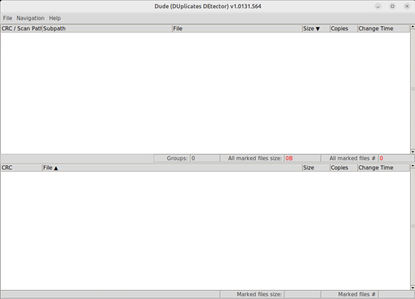

# DUDE (DUplicates DEtector)

GUI utility for finding duplicated files, delete or link them to save space.

## Features:
- Scanning for duplicated files
- Two synchronized panels
  - duplicates groups
  - directory of selected file
- Two stage processing
  - marking of files with multiple criteria
  - taking action on marked files
- Command Line parameters for integration with favorite file manager (e.g. Double Commander)


## Supported platforms:
- Linux
- Windows

## Licensing
- **dude** is licensed under **[MIT license](./LICENSE)**

## Dude GUI (gif not up to date):


## Download page:

The portable executable for Linux and Windows can be downloaded from the Releases site  :

https://github.com/PJDude/dude/releases

## General usage:
- scan for duplicate files
- mark files for processing
- take action on marked files (delete, softlink, hardlink)


## Command line examples:
* Start scanning for duplicates in current directory:
```
dude .
```
* Start scanning in specified directories:
```
dude c:\order d:\mess
```
* check full set of available parameters:
```
dude --help
```


## Technical information
- Scanning process analyzes selected paths and groups files with the same size. **Dude** compare files by calculated **SHA1** hash of file content. CRC calculation is done in order, from the largest files to the smallest files, in separate threads for every identified device (drive). Number of active threads is limited by available CPU cores. Aborting of CRC calculation gives only partial results - not all files may be identified as duplicates. Restarted scanning process will use cached data.
- Calculated CRC is stored in internal cache which allows re-use it in future operation and speedup of searching of duplicates (e.g. with different set of search paths). Key of cache database is pair of inode of file and file modification time stored separately for every device-id, so any file modification or displacement will result in invalidation of obsolete data and recalculation of CRC.
- Marking files does not cause any filesystem change. Any file deletion or linking needs confirmation and is logged.
- Just before files processing, state of files (ctime) is compared with stored data. In case of inconsistency (state of files was changed somehow during operation between scanning/CRC calculation and files processing) action is aborted and data invalidated.
- **Dude** is written in **python3** with **Tkinter** and compiled to single binary executable with **[Nuitka](https://github.com/Nuitka/Nuitka)** (great tool) for better performance. GitHub build for linux platform is done in **ubuntu-20.04** container. In case of **glibc** incompatibility it is always possible to build Your own binary (**nuitka.run.sh**) or run python script (**dude.py**)
- **Dude** for windows ~~is build as two binary executables: **dude.exe** and **dudegui.exe**. They should be saved in the same path. **dude.exe** is basically only to respond on console to --help parameter or for passing command line parameters (if correct) to dudegui.exe. **dudegui.exe** will also accept parameters but will not respond to the console.~~ hides the console when starting the GUI. To keep the console untouched, use the --nohide parameter.

###### Manual build (linux):
```
pip install -r requirements.txt
./scripts/nuitka.run.sh
```
###### Manual build (windows):
```
pip install -r requirements.txt
.\scripts\nuitka.run.bat
```
###### Manual running of python script:
```
pip install appdirs
python ./src/dude.py
```
###### Stage of development
Dude is in the working, pre-release stage.
